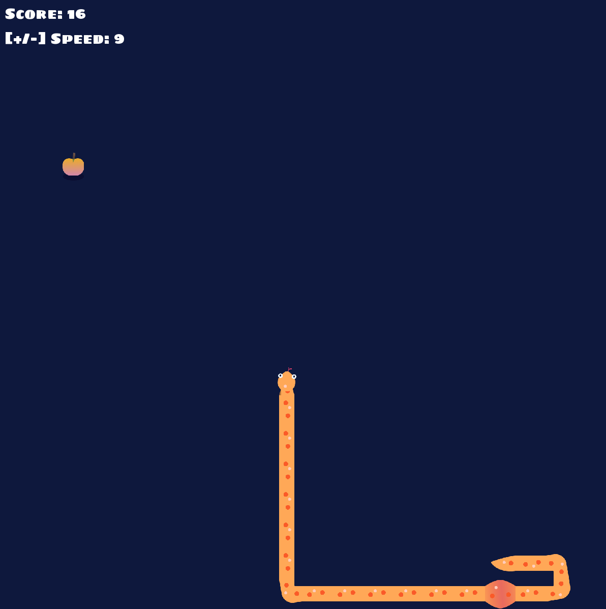
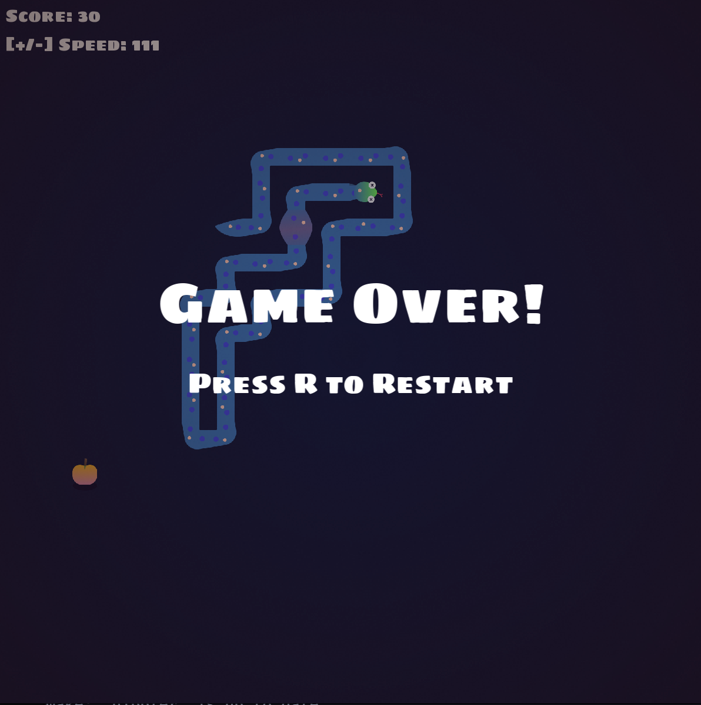

# Nibbler

🐍 A snake game with an graphical interface you can change at run time




## Web version

A standalone Svelte + Vite + Tailwind port lives in [`web/`](./web):

```sh
cd web && npm install && npm run dev
```

The grid fills the window by default. Options are passed in the URL, e.g. `/?width=30&height=20&multiplayer&bot&speed=10&no-music`.

### Deployment

The web version is deployed as Cloudflare Worker static assets at
[snake.mathias.ninja](https://snake.mathias.ninja). The custom domain is configured in
`wrangler.jsonc` and serves the build output from `web/dist`.

Cloudflare Workers Builds watches the `main` branch and deploys every new commit with
`npx wrangler deploy`, which builds the web app first (`build.command` in `wrangler.jsonc`).

## Contributors
 - Code: [@Edracoon](https://github.com/Edracoon) & [@matubu](https://github.com/matubu)
 - Graphical assets: [@matubu](https://github.com/matubu)
 - Music: [@dsamain](https://github.com/dsamain)
